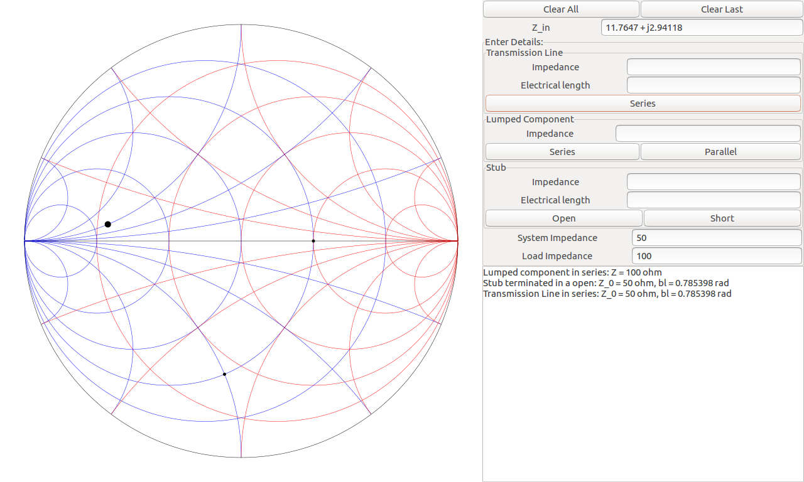

# SmithChart
A simple smith chart written in C++ and GTK+3. 
It currently supports
+ Transmission line in series.
+ Lumped component in series and parallel.
+ Open/short stub in parallel.
+ Simple expression evaluation
+ Removing last entry
+ Clearing all entries
+ Panel showing the properties of all active components.

### Expression evaluation
Implemented to allow electrical length to be entered in radians
+ a
+ a / b
+ a * pi
+ pi / b
+ a * pi / b

where a and b are real numbers.

  

